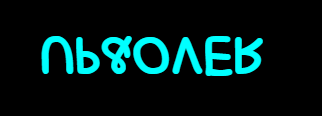

# Animaciones
## Tabla de contenidos
| Índice | Título |
|--|--|
| 1 | LETRAS |
| 2 | NUBES  |
| 3 | CAMINAR |
| 4 | ROBOT |

### Instalación
Deberás ejecutar el siguiente comando para descargar;
```bash
sudo apt-get install update
sudo apt-get install upgrade
```

### Sección 
- ## letras
-En esta sección se hizo uso de HTML y CSS para llevar a cabo la animación de una pequeña frase.
- El archivo `index.html` es el archivo que contiene la frase.
- El archivo `style.css` es el archivo en donde se le dió la animación que se requería.



- ## Nubes
-En esta sección se hizo uso de HTML y CSS para llevar a cabo la animación de una nube en movimiento.
- El archivo `index1.html` es el archivo que contiene todo lo necesario para la animación
.
- El archivo `style1.css` es el archivo en donde se le dió la animación que se requería.
- El archivo `img1` es el archivo en donde se contienen las imagenes de esta animación .


- ## Caminar
-En esta sección se hizo uso de HTML y CSS para llevar a cabo la animación de un hombre caminando.
- El archivo `index2.html` es el archivo que contiene todo lo necesario para la animación
.
- El archivo `style2.css` es el archivo en donde se le dió la animación que se requería.
- El archivo `img2` es el archivo en donde se contienen las imagenes de esta animación .


- ## Robot
-En esta sección se hizo uso de HTML y CSS para llevar a cabo la animación de un hombre caminando.
- El archivo `index3.html` es el archivo que contiene todo lo necesario para la animación
.
- El archivo `style3.css` es el archivo en donde se le dió la animación que se requería.
- El archivo `img3` es el archivo en donde se contienen las imagenes de esta animación .


## Características del diseño

- Diseño responsivo utilizando unidades vw (viewport width) para la mayoría de las dimensiones.
- Posicionamiento absoluto para la mayoría de los elementos.
- Uso de imágenes.

## Instrucciones de uso

1. Clona este repositorio o descarga los archivos en tu máquina local.
2. Abre el archivo `index.html` `index1.html` `index2.html` y `index3.html` en un navegador web compatible.

## Créditos

Este proyecto fue desarrollado por Jhonatan Omaña como repaso de animaciones vistas en HTML y CSS.